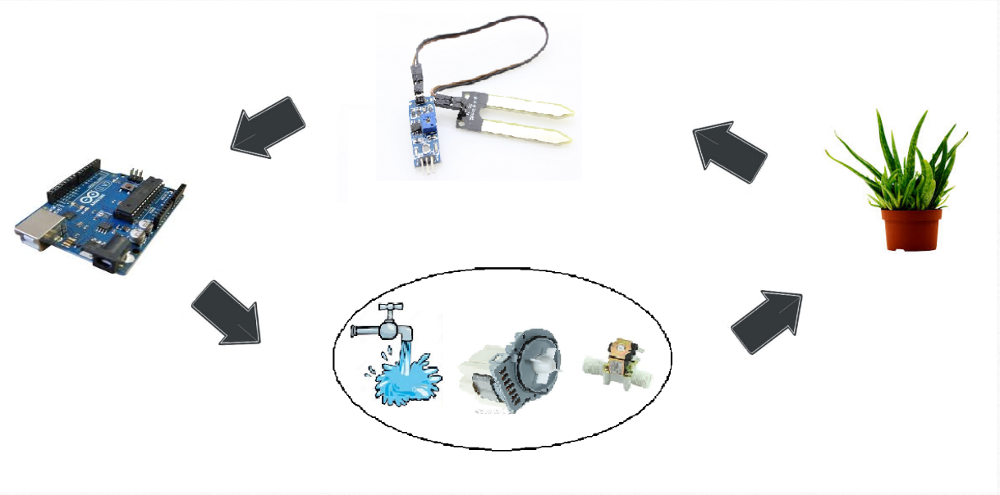
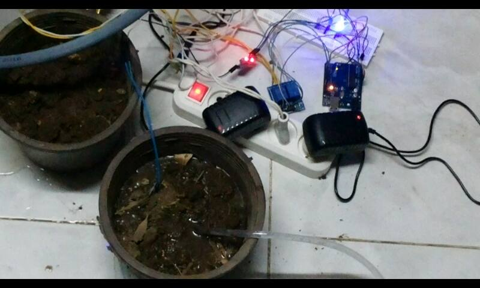

# Arduino Automatic Irrigation System

An Arduino-based application that automates soil irrigation, by continuously measuring soil humidity value. The water-source is controlled based on the real-time reading of the soil humidity sensor.  

## Hardware Components List :

- 1 Arduino-Uno Board.
- 1 Soil Humidity Sensor.
- 2-Channel Relay Module.
- 1 Solenoid Water Valve.
- 12V - 2A Adabtor.
- Motor.
- Red,Green,Blue LEDs.
- 1 Breadboard.
- Jumper Wires.

## Project Overall Idea:

The overall idea is to measure the soil humidity value using soil humidity sensor and send the value to the arduino : 

- If the value is below certain value (Red LED is ON) --> Arduino controls the relay to open the solenoid valve, and water flows until retaining the desired humidity value.
- While the humidity value equals the desired value (Green LED is ON) --> Nothing happens, solenoid valve remains closed and water does not passes.
- If the humidity value is greater than certain value - over irrigation- (Blue LED is ON) --> Solenoid valve remains closed but the blue LED notifies the user of over irrigation.

## Real Photo:

